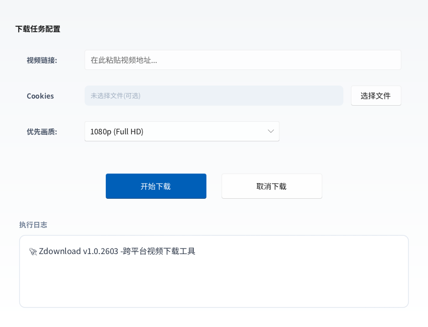
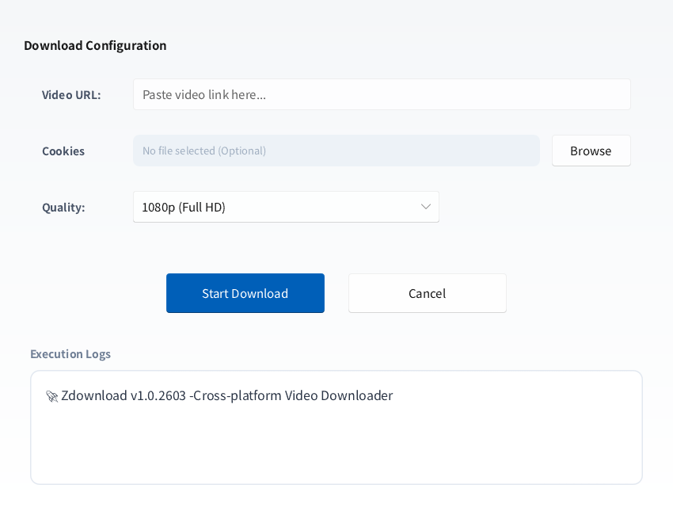

# 🚀 Zdownload - 跨平台视频下载工具

基于 **Rust** 与 **Slint** 框架开发的轻量级视频下载前端。本项目坚持系统极简原则，深度适配 **Debian 13 (Trixie)** 与 **GNOME 48**，并支持从 Linux 交叉编译至 Windows。

---

## 🌐 多语言界面展示 / UI Preview

| 🇨🇳 简体中文界面 | 🇺🇸 English Interface |
| :---: | :---: |
|  |  |
| *支持原生中文显示* | *Full English Support* |

---

## ✨ 核心特性

* **🦀 Rust 驱动**：高性能、内存安全，极低的系统资源占用。
* **🎨 现代 UI**：基于 Slint 声明式 UI，完美兼容 Wayland 与 X11。
* **🛡️ 零运行依赖**：采用静态链接策略，无需预装 OpenSSL 或图形开发库即可运行。
* **📦 跨平台支持**：一份代码同时支持 Linux 原生构建与 Windows 交叉编译。

---

## 🐧 Linux 平台构建指南 (Debian/Ubuntu)

本工具遵循系统极简原则，仅需安装核心构建依赖即可完成编译。

### 1. 安装开发依赖
用于 GUI 渲染与安全传输的底层开发库（约 18MB）：

```bash
sudo apt update
sudo apt install -y --no-install-recommends build-essential pkg-config libwayland-dev libxkbcommon-dev libfontconfig1-dev libssl-dev
```

### 2. 配置 Rust 环境
如未安装 Rust 工具链，请执行：

```bash
curl --proto '=https' --tlsv1.2 -sSf https://sh.rustup.rs | sh
source $HOME/.cargo/env
```

### 3. 编译生产版本
开启 LTO 优化与符号裁剪，以获得极致的运行性能与最小的文件体积：

```bash
git clone https://github.com/ArcMantis/Zdownload.git
cd Zdownload
cargo build --release
```

> 产物路径：target/release/zdownloadwin

---

## 🪟 Windows 平台交叉编译 (Cross-Build)

在 Debian 环境下直接构建 Windows 绿色版 (.exe)：

### 1. 添加编译目标与工具链
```bash
rustup target add x86_64-pc-windows-gnu
sudo apt update && sudo apt install -y binutils-mingw-w64-x86-64 gcc-mingw-w64-x86-64
```

### 2. 执行交叉编译
```bash
cargo build --release --target x86_64-pc-windows-gnu
```

---

## 📦 运行与兼容性说明

### 直接运行 (Linux)
```bash
chmod +x ./target/release/zdownloadwin
./target/release/zdownloadwin
```

### 兼容性验证
经 `ldd` 深度验证，生成的二进制文件仅链接 Linux 核心基础库（libc, libfontconfig, libz 等），在以下环境**开箱即用**，无需安装额外的 `-dev` 包：
* **Debian 12/13+**
* **Ubuntu 22.04/24.04+**
* **Arch Linux / Fedora / openSUSE**

---

## 🛠️ 构建优化配置 (Cargo.toml)

项目已预设以下 Release 优化，确保生成的二进制文件精简高效：
```toml
[profile.release]
opt-level = "z"      # 针对体积极致优化
lto = true           # 开启链接时优化
strip = true         # 自动剔除调试符号
```
---

## 📔开源库
- 视频下载：[yt-dlp](https://github.com/yt-dlp/yt-dlp)

## 📄 开源协议
本项目采用 [GNU GPL v3.0 license](LICENSE) 协议开源。